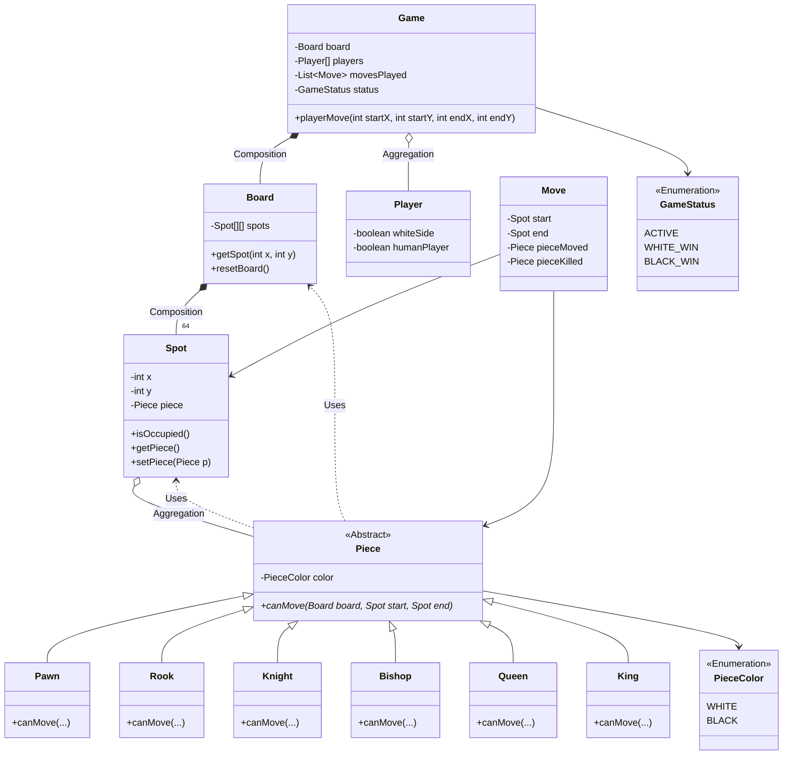

# Low Level Design (LLD) - Chess Game

## Class Diagram

The following diagram illustrates the relationships between the core classes of the Chess system.

## Relationship Details

### 1. Inheritance (Solid Arrow with Triangle)
- **`Piece`** is the parent for **`Pawn`**, **`Rook`**, **`King`**, etc.
- This enables **Polymorphism**. The `Board` holds `Piece` references, but at runtime, they are specific types.

### 2. Composition (Solid Diamond)
- **`Game`** $\rightarrow$ **`Board`**: The `Board` is integral to the `Game`. If the `Game` is destroyed, that specific board instance is irrelevant.
- **`Board`** $\rightarrow$ **`Spot`**: The `Board` is *composed* of 64 `Spot`s. A `Spot` cannot exist meaningfully without the `Board`.

### 3. Aggregation (Hollow Diamond)
- **`Spot`** $\rightarrow$ **`Piece`**: A `Spot` *has a* `Piece`, but the `Piece` can be removed (moved) and exist elsewhere. It is a loose relationship.

### 4. Dependency (Dashed Arrow)
- **`Piece`** $\rightarrow$ **`Board`**: The `canMove` method *uses* the `Board` to check for collisions, but `Piece` does not *own* the `Board`.
